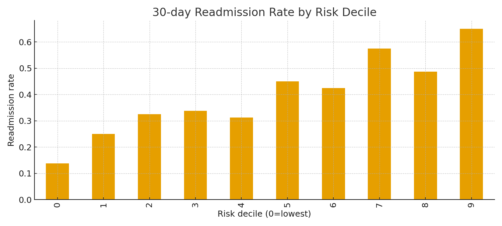

---
layout: default
title: Healthcare Analytics Portfolio
---

  <h1>Turning Healthcare Data into Actionable Insights</h1>
  
From messy sources to clear decisions—cleaning, analysis, and automated reporting.

  

    <a class="btn primary" href="#work">Explore My Projects</a>
    <a class="btn ghost" href="https://github.com/{{ site.github.owner_name }}/{{ site.github.repository_name }}">View on GitHub</a>
  

  

    
Synthetic, anonymized datasets

    
Reproducible Python workflows

    
Auto-generated weekly report

  

## Overview
Imagine hospital feedback, readmission flags, and claim lines—organized and decision-ready.  
This portfolio shows how I clean, analyze, and visualize **healthcare** data to surface insights fast.

**Process**: Raw Data → Cleaning → Analysis → Visualization → Insights

---

## Why Healthcare Analytics?
- Improve patient experience and communication.  
- Reduce 30-day readmissions and length of stay.  
- Standardize claims data for reliable cost/volume views.

---

## Featured visuals {#work}

  

    <figure>
      
      <figcaption><strong>Patient Experience by Department.</strong> Highlights where communication and cleanliness lead—and where to focus.</figcaption>
    </figure>
  

  

    <figure>
      
      <figcaption><strong>Readmission Rate by Risk Decile.</strong> Calibrates risk; higher deciles show expected lift for targeted intervention.</figcaption>
    </figure>
  

See also: <a href="./report.md">Weekly Insights (Markdown)</a> · <a href="./cleaned.csv">Cleaned claims CSV</a>

---

## Mini case study: From signal to action
**Challenge:** Identify drivers of patient satisfaction and readmission risk.  
**Approach:** Cleaned 500–800 synthetic records, visualized department-level means and risk deciles, automated a weekly report.  
**Impact:** Clear priorities for unit leaders and quality teams; reproducible pipeline for ongoing monitoring.

---

## Skills & Tools

  PythonPandasMatplotlibSPSS
  Markdown automationData cleaningVisualization

---

## What I bring to your team
- Data cleaning & reproducibility you can trust.  
- Patient-experience and readmissions analytics.  
- Automated reporting workflows.  
- Clear, actionable insights for leaders.

<footer class="small">
  All datasets here are synthetic and anonymized.
</footer>
